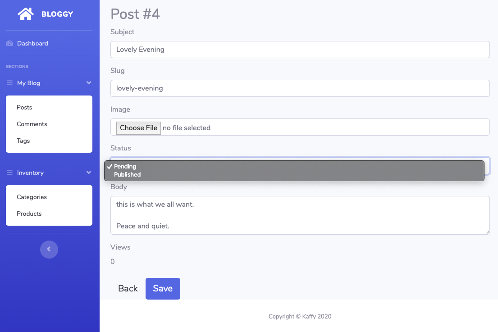

# Kaffy

Extremely simple yet powerful admin interface for phoenix applications

## Why another admin interface

Kaffy was created out of a need to have a minimum, flexible, and customizable admin interface 
without the need to touch the current codebase. It should work out of the box just by adding some
configs in your `config.exs` file (with the exception of adding a one liner to your `router.ex` file).

A few points that encouraged the creation of Kaffy:

- Taking contexts into account.
  - Supporting contexts makes the admin interface better organized.
- Can handle as many schemas as necessary.
  - Whether we have 1 schema or 1000 schemas, the admin interface should adapt well.
- Have a visually pleasant user interface.
  - This might be subjective.
- No generators or generated templates.
  - I believe the less files there are the better. This also means it's easier to upgrade for users when releasing new versions. This might mean some flexibility and customizations will be lost, but it's a trade-off.
- Existing schemas/contexts shouldn't have to be modified.
  - I shouldn't have to change my code in order to adapt to the package, the package should adapt to my code.
- Should be easy to use whether with a new project or with existing projects with a lot of schemas.
  - Adding kaffy should be as easy for existing projects as it is for new ones.
- Highly flexible and customizable.
  - Provide as many configurable options as possible.
- As few dependencies as possible.
  - Currently kaffy only depends on phoenix and ecto.
- Simple authorization.
  - I need to limit access for some admins to some schemas.
- Minimum assumptions.
  - Need to modify a schema's primary key? Need to hide a certain field? No problem.

## Installation

```elixir
def deps do
  [
    {:kaffy, "~> 0.1.2"}
  ]
end
```

## What You Get


## Minimum configs

```elixir
# in your router.ex
use Kaffy.Routes, scope: "/admin"

# in your endpoint.ex
plug Plug.Static,
  at: "/kaffy",
  from: :kaffy,
  gzip: false,
  only: ~w(css img js scss vendor)

# in your config/config.exs
config :kaffy,
  ecto_repo: Bloggy.Repo,
  router: BloggyWeb.Router,
  resources: [
    blog: [
      schemas: [
        post: [schema: Bloggy.Blog.Post],
        # list your schemas for the blog context
      ]
    ]
  ]
```

## Customizations

```elixir
# config.exs
config :kaffy,
  admin_title: "Bloggy",
  ecto_repo: Bloggy.Repo,
  router: BloggyWeb.Router,
  resources: [
    blog: [
      name: "My Blog", # a custom name for this context/section.
      schemas: [
        post: [schema: Bloggy.Blog.Post, admin: Bloggy.Admin.PostAdmin],
        comment: [schema: Bloggy.Blog.Comment],
        tag: [schema: Bloggy.Blog.Tag]
      ]
    ],
    inventory: [
      name: "Inventory",
      schemas: [
        category: [schema: Bloggy.Products.Category, admin: Bloggy.Admin.CategoryAdmin],
        product: [schema: Bloggy.Products.Product, admin: Bloggy.Admin.ProductAdmin]
      ]
    ]
  ]
```

The following admin module is what the screenshot above is showing:

```elixir
# all the functions are optional

defmodule Bloggy.Admin.PostAdmin do
  def index(_schema) do
    # index/1 should return a keyword list of fields and
    # their options.
    # Supported options are :name and :value.
    # Both options can be a string or an anonymous function.
    # If a fuction is provided, the current entry is passed to it.
    # If this function is not defined, Kaffy will return all the fields of the schema and their default values
    [
      id: %{name: "ID", value: fn post -> post.id + 100 end},
      title: nil, # this will render the default name for this field (Title) and its default value (post.title)
      views: %{name: "Hits", value: fn post -> "<strong>#{post.views}</strong>" end},
      published: %{name: "Published?", value: fn post -> published?(post) end},
      comment_count: %{name: "Comments", value: fn post -> comment_count(post) end}
    ]
  end

  def form_fields(_schema) do
    # Supported options are:
    # :label, :type, :choices, :permission
    # :type can be any ecto type in addition to :file and :textarea
    # If :choices is provided, it must be a keyword list and
    # the field will be rendered as a <select> element regardless of the actual field type.
    # Setting :permission to :read will make the field non-editable. It is :write by default.
    # If you want to remove a field from being rendered, just remove it from the list.
    # If this function is not defined, Kaffy will return all the fields with
    # their default types based on the schema.
    [
      title: %{label: "Subject"},
      slug: nil,
      image: %{type: :file},
      status: %{choices: [{"Pending", "pending"}, {"Published", "published"}]},
      body: %{type: :textarea, rows: 3},
      views: %{permission: :read}
    ]
  end

  def ordering(_schema) do
    # This returns how the entries should be ordered
    # if this function is not defined, Kaffy will return [desc: :id]
    [desc: :id]
  end

  def authorized?(_schema, _conn) do
    # authorized? is passed the schema and the Plug.Conn struct and
    # should return a boolean value.
    # returning false will prevent the access of this resource for the current user/request
    # if this function is not defined, Kaffy will return true.
    true
  end

  def create_changeset(schema, attrs) do
    # this function should return a changeset for creating a new record
    # if this function is not defined, Kaffy will try to call:
    # schema.changeset/2
    # and if that's not defined, Ecto.Changeset.change/2 will be called.
    Bloggy.Blog.Post.create_changeset(schema, attrs)
  end

  def update_changeset(entry, attrs) do
    # this function should return a changeset for updating an existing record.
    # if this function is not defined, Kaffy will try to call:
    # schema.changeset/2
    # and if that's not defined, Ecto.Changeset.change/2 will be called.
    Bloggy.Blog.Post.update_changeset(entry, attrs)
  end

  def singular_name(_schema) do
    # if this function is not defined, Kaffy will use the name of
    # the last part of the schema module (e.g. Post)
    "Post"
  end

  def plural_name(_schema) do
    # if this function is not defined, Kaffy will use the singular
    # name and add a "s" to it (e.g. Posts)
    "Posts"
  end

  def published?(post) do
    if post.status == "published",
      do: ~s(<span class="badge badge-success"><i class="fas fa-check"></i>),
      else: ~s(<span class="badge badge-light"><i class="fas fa-times"></i></span>)
  end

  defp comment_count(post) do
    post = Barbican.Repo.preload(post, :comments)
    length(post.comments)
  end
end
```

## Schema Form



The form is constructed from the `form_fields/1` function if it exists in the admin module.
Notice that even though the `status` field is of type `:string`, it is rendered as a `select` element.
Also notice that the `views` field is in "readonly" mode since we gave it the `:read` permission.
