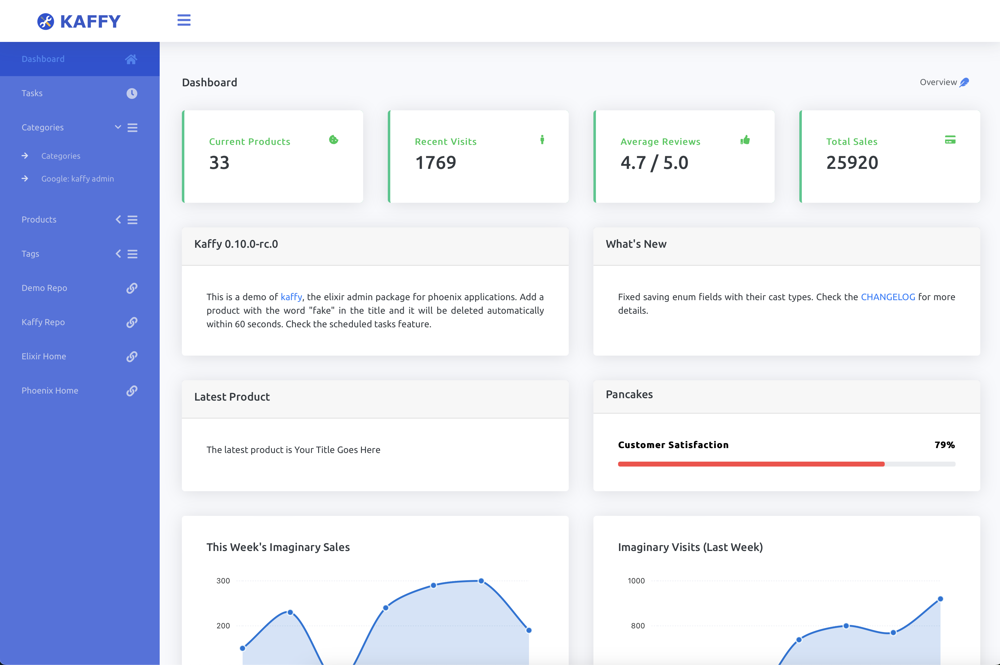
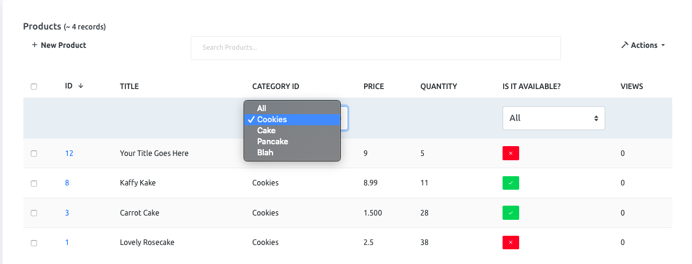
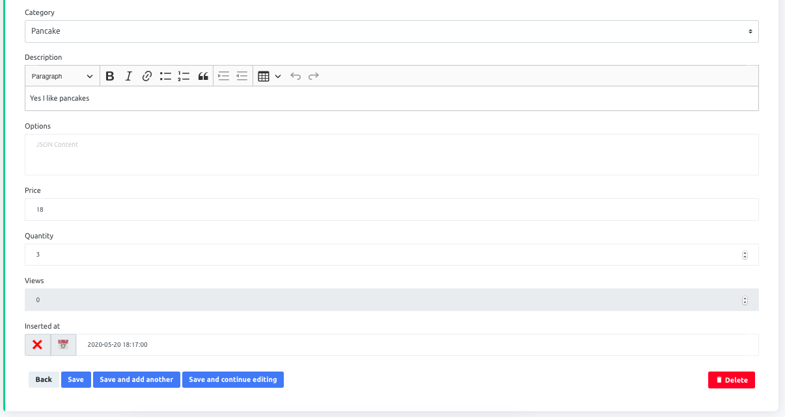
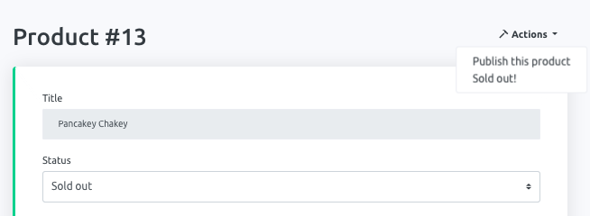

# Kaffy

[](https://hex.pm/packages/kaffy)
[](https://hexdocs.pm/kaffy/)
[](https://hex.pm/packages/kaffy)
[](https://github.com/aesmail/kaffy/blob/master/LICENSE.md)
[](https://github.com/aesmail/kaffy/commits/master)



## Introduction

Kaffy was created out of a need to have a powerfully simple, flexible, and customizable admin interface
without the need to touch the current codebase. It was inspired by django's lovely built-in `admin` app and rails' powerful `activeadmin` gem.

## Sections

- [Introduction](#introduction)
- [Sections](#sections)
- [Sponsors](#sponsors)
- [Demo](#demo)
- [Minimum Requirements](#minimum-requirements)
- [Installation](#installation)
    - [Add `kaffy` as a dependency](#add-kaffy-as-a-dependency)
    - [These are the minimum configurations required](#these-are-the-minimum-configurations-required)
- [Customizations](#customizations)
  - [Configurations](#configurations)
    - [Breaking change in v0.9](#breaking-change-in-v09)
  - [Dashboard page](#dashboard-page)
  - [Side Menu](#side-menu)
    - [Custom Links](#custom-links)
  - [Custom Pages](#custom-pages)
  - [Index pages](#index-pages)
  - [Form Pages](#form-pages)
    - [Association Forms](#association-forms)
  - [Custom Form Fields](#custom-form-fields)
  - [Customize the Queries](#customize-the-queries)
  - [Extensions](#extensions)
  - [Embedded Schemas and JSON Fields](#embedded-schemas-and-json-fields)
  - [Search](#search)
  - [Authorization](#authorization)
  - [Changesets](#changesets)
  - [Singular vs Plural](#singular-vs-plural)
  - [Custom Actions](#custom-actions)
    - [Single Resource Actions](#single-resource-actions)
    - [List Actions](#list-actions)
  - [Callbacks](#callbacks)
  - [Overwrite actions](#overwrite-actions)
  - [Scheduled Tasks](#scheduled-tasks)
- [The Driving Points](#the-driving-points)

## Sponsors

Sponsor the [development of Kaffy](https://github.com/sponsors/aesmail) through GitHub Sponsors.

## Demo

[Check out the simple demo here](https://kaffy.fly.dev/admin/)

## Minimum Requirements

Starting with v0.10.0, Kaffy will officially support the latest two phoenix versions.

| Kaffy   | Supported phoenix versions |
|---------|----------------------------|
| v0.10.0 | 1.6, 1.7.0                 |
| v0.9.X  | 1.5, 1.6, 1.7.0            |
|         |                            |


## Support Policy

The latest released `major.minor` version will be supported. For example, if the latest version is `0.9.0`, then `0.9.1` will be released with bug fixes. If a new version `0.10.0` is released, then `0.9.1` will no longer receive bug fixes or security patches.

## Installation

#### Add `:kaffy` as a dependency
```elixir
def deps do
  [
    {:kaffy, "~> 0.10.0"}
  ]
end
```

If you are using `kaffy` v0.9.x with `phoenix` 1.7, you need to add `phoenix_view` to your dependencies:
```elixir
def deps do
  [
    {:phoenix_view, "~> 2.0.2"},
    {:kaffy, "~> 0.9.4"}
  ]
end
```

#### These are the minimum configurations required

```elixir
# in your router.ex
use Kaffy.Routes, scope: "/admin", pipe_through: [:some_plug, :authenticate]
# :scope defaults to "/admin"
# :pipe_through defaults to kaffy's [:kaffy_browser]
# when providing pipelines, they will be added after :kaffy_browser
# so the actual pipe_through for the previous line is:
# [:kaffy_browser, :some_plug, :authenticate]

# in your endpoint.ex
# configure the path to your application static assets in :at
# the path must end with `/kaffy`
plug Plug.Static,
  at: "/kaffy", # or "/path/to/your/static/kaffy"
  from: :kaffy,
  gzip: false,
  only: ~w(assets)

# in your config/config.exs
config :kaffy,
  # required keys
  otp_app: :my_app, # required
  ecto_repo: MyApp.Repo, # required
  router: MyAppWeb.Router, # required
  # optional keys
  admin_title: "My Awesome App",
  admin_logo: [
    url: "https://example.com/img/logo.png",
    style: "width:200px;height:66px;"
  ],
  admin_logo_mini: "/images/logo-mini.png",
  hide_dashboard: true,
  home_page: [schema: [:accounts, :user]],
  enable_context_dashboards: true, # since v0.10.0
  admin_footer: "Kaffy &copy; 2023" # since v0.10.0
```

Note that providing pipelines with the `:pipe_through` option will add those pipelines to kaffy's `:kaffy_browser` pipeline which is defined as follows:

```elixir
pipeline :kaffy_browser do
  plug :accepts, ["html", "json"]
  plug :fetch_session
  plug :fetch_flash
  plug :protect_from_forgery
  plug :put_secure_browser_headers
end
```
### Phoenix version 1.7
Note that if you use Phoenix version 1.7 you also need to manually add the use of phoenix views in your project.
Follow the instructions at https://hexdocs.pm/phoenix_view/Phoenix.View.html

You will also need to change `helpers: false` to `true` in the `myapp_web.ex` file as shown in example below.
```elixir
  # lib/myapp_web.ex
  def router do
    quote do
      use Phoenix.Router, helpers: true # <- set to true
```

## Customizations

### Configurations

#### Breaking change in v0.9

If you're upgrading from an earlier version to v0.9, you need to replace your `:schemas` with `:resources`.

If you don't specify a `resources` option in your configs, Kaffy will try to auto-detect your schemas and your admin modules. Admin modules should be in the same namespace as their respective schemas in order for kaffy to detect them. For example, if you have a schema `MyApp.Products.Product`, its admin module should be `MyApp.Products.ProductAdmin`.

Otherwise, if you'd like to explicitly specify your schemas and their admin modules, you can do like the following:

```elixir
# config.exs
config :kaffy,
  admin_title: "My Awesome App",
  admin_logo: "/images/logo.png",
  admin_logo_mini: "/images/logo-mini.png",
  admin_footer: "Kaffy &copy; 2023",
  hide_dashboard: false,
  enable_context_dashboards: true,
  home_page: [kaffy: :dashboard],
  ecto_repo: MyApp.Repo,
  router: MyAppWeb.Router,
  resources: &MyApp.Kaffy.Config.create_resources/1

# in your custom resources function
defmodule MyApp.Kaffy.Config do
  def create_resources(_conn) do
    [
      blog: [
        name: "My Blog", # a custom name for this context/section.
        resources: [ # this line used to be "schemas" in pre v0.9
          post: [schema: MyApp.Blog.Post, admin: MyApp.SomeModule.Anywhere.PostAdmin],
          comment: [schema: MyApp.Blog.Comment],
          tag: [schema: MyApp.Blog.Tag, in_menu: false]
        ]
      ],
      inventory: [
        name: "Inventory",
        resources: [
          category: [schema: MyApp.Products.Category, admin: MyApp.Products.CategoryAdmin],
          product: [schema: MyApp.Products.Product, admin: MyApp.Products.ProductAdmin]
        ]
      ]
    ]
  end
end
```

Starting with Kaffy v0.9, the `:resources` option can take a literal list or a function.
If a function is provided, it should take a conn and return a list of contexts and schemas like in the example above.
Passing a conn to the function provides more flexibility and customization to your resources list.

You can set the `:hide_dashboard` option to true to hide the dashboard link from the side menu.
To change the home page, change the `:home_page` option to one of the following:

- `[kaffy: :dashboard]` for the default dashboard page.
- `[schema: ["blog", "post"]]` to make the home page the index page for the `Post` schema under the 'Blog' context.
- `[page: "my-custom-page"]` to make the custom page with the `:slug` "my-custom-page" the home page. See the Custom Pages section below.

Note that, for auto-detection to work properly, schemas in different contexts should have different direct "prefix" namespaces. That is:

```elixir
# auto-detection works properly with this:
MyApp.Posts.Post
MyApp.Posts.Category
MyApp.Products.Product
MyApp.Products.Category # this Category will not be confused with Posts.Category

# auto-detection will be confused with this:
# both Category schemas have the same "Schemas" prefix.
MyApp.Posts.Schemas.Post
MyApp.Posts.Schemas.Category
MyApp.Products.Schemas.Product
MyApp.Products.Schemas.Category

# To fix this, define resources manually:
resources: [
  posts: [
    resources: [
      post: [schema: MyApp.Posts.Schemas.Post],
      category: [schema: MyApp.Posts.Schemas.Category]
    ]
  ],
  products: [
    resources: [
      product: [schema: MyApp.Products.Schemas.Product],
      category: [schema: MyApp.Products.Schemas.Category]
    ]
  ]
]
```

### Dashboard page

Kaffy supports dashboard customizations through `widgets`.


Currently, kaffy provides support for 4 types of widgets:

- `text` widgets. Suitable for display relatively long textual information. Candidates: a short review, a specific message for the admin, etc.
- `tidbit` widgets. Suitable for tiny bits of information (one word, or one number). Cadidates: total sales, a specific date, system status ("Healthy", "Down"), etc.
- `progress` widgets. Suitable for measuring progress in terms of percentages. Candidates: task progress, survey results, memory usage, etc.
- `chart` widgets. Suitable for displaying chart data with X and Y values. Candidates: any measurable number over a period of time (e.g. sales, visits, etc).

Widgets have shared options:

- `:type` (required) is the type of the widget. Valid options are `text`, `tidbit`, `progress`, and `chart`.
- `:title` (required) is the title for the widget. What this widget is about.
- `:content` (required) is the main content of the widget. This can be a string or a map depending on the type of widget.
- `:order` (optional) is the displaying order of the widget. Widgets are display in order based on this value. The default value is 999.
- `:width` (optional) is the width the widget should occupy on the page. Valid values are 1 to 12. The default for tidbits is 3 and the others 6.
- `:percentage` (required for progress widgets) is the percentage value for the progress. This must be an integer.
- `:full_icon` (optional for tidbit widgets) is the icon displayed next to the tidbit's `content`. You have to specify the full name given by FontAwesome like `fas fa-thumbs-up`.
- `:icon` (optional for tidbit widgets) is the icon displayed next to the tidbit's `content`. Any FontAwesome-valid icon is valid here. For example: `thumbs-up`. But it's limited to the `fas` group. For full defintion see `:full_icon`.

When defining a chart widget, the content must be a map with the following required keys:

- `:x` must be a list of values for the x-axis.
- `:y` must be a list of numbers (integers/floats) for the y-axis.
- `:y_title` must be a string describing `:y` (e.g. USD, Transactions, Visits, etc)


To create widgets, define `widgets/2` in your admin modules.

`widgets/2` takes a schema and a `conn` and must return a list of widget maps:

```elixir
defmodule MyApp.Products.ProductAdmin do
  def widgets(_schema, _conn) do
    [
      %{
        type: "tidbit",
        title: "Average Reviews",
        content: "4.7 / 5.0",
        icon: "thumbs-up",
        order: 1,
        width: 6,
      },
      %{
        type: "progress",
        title: "Pancakes",
        content: "Customer Satisfaction",
        percentage: 79,
        order: 3,
        width: 6,
      },
      %{
        type: "chart",
        title: "This week's sales",
        order: 8,
        width: 12,
        content: %{
          x: ["Mon", "Tue", "Wed", "Thu", "Today"],
          y: [150, 230, 75, 240, 290],
          y_title: "USD"
        }
      }
    ]
  end
end
```

Kaffy will collect all widgets from all admin modules and orders them based on the `:order` option if present and displays them on the dashboard page.

### Side Menu

#### Custom Links

Kaffy provides support for adding custom links to the side navigation menu.

```elixir
defmodule MyApp.Products.ProductAdmin do
  def custom_links(_schema) do
    [
      %{name: "Source Code", url: "https://example.com/repo/issues", order: 2, location: :top, icon: "paperclip"},
      %{name: "Products On Site", url: "https://example.com/products", location: :sub, target: "_blank"},
      %{name: "Support us", url: "https://example.com/products", location: :bottom, target: "_blank",  icon: "usd"},
    ]
  end
end
```

`custom_links/1` takes a schema and should return a list of maps with the following keys:

- `:name` to display as the text for the link.
- `:url` to contain the actual URL.
- `:method` the method to use with the link.
- `:order` to hold the displayed order of this link. All `:sub` links are ordered under the schema menu item directly before the following schema.
- `:location` can be either `:sub`, `:top` or `:bottom`. `:sub` means it's under the schema sub-item. `:top` means it's displayed at the top of the menu below the "Dashboard" link. `:bottom` means it's displayed at the bottom of the menu below the last context menu item. Links are ordered based on the `:order` value. The default value is `:sub`.
- `:icon` is the icon displayed next to the link. Any FontAwesome-valid icon is valid here. For example: `paperclip`.
- `:target` to contain the target to open the link: `_blank` or `_self`. `_blank` will open the link in a new window/tab, `_self` will open the link in the same window. The default value is `_self`.


### Custom Pages

Kaffy allows you to add custom pages like the following:


To add custom pages, you need to define the `custom_pages/2` function in your admin module:

```elixir
defmodule MyApp.Products.ProductAdmin do
  def custom_pages(_schema, _conn) do
    [
      %{
        slug: "my-own-thing",
        name: "Secret Place",
        view: MyAppWeb.ProductView,
        template: "custom_product.html",
        assigns: [custom_message: "one two three"],
        order: 2
      }
    ]
  end
end
```

The `custom_pages/2` function takes a schema and a conn and must return a list of maps corresponding to pages.
The maps have the following keys:

- `:slug` to indicate the url of the page, e.g., `/admin/p/my-own-thing`.
- `:name` for the name of the link on the side menu.
- `:view` to set the view from your own app.
- `:template` to set the custom template you want to render in Kaffy's layout.
- `:assigns` (optional) to hold the assigns for the template. Default to an empty list.
- `:order` is the order of the page among other pages in the side menu.

### Index pages

The `index/1` function takes a schema and must return a keyword list of fields and their options.

If the options are `nil`, Kaffy will use default values for that field.

If this function is not defined, Kaffy will return all fields with their respective values.

```elixir
defmodule MyApp.Blog.PostAdmin do

  def popular?(p) do
    if (p.popular), do: "✅", else: "❌"
  end

  def index(_) do
    [
      title: nil,
      views: %{name: "Hits"},
      date: %{name: "Date Added", value: fn p -> p.inserted_at end},
      popular: %{name: "Popular?", value: fn p -> popular?(p) end},
    ]
  end
end
```

Result


Notice that the keyword list keys don't necessarily have to be schema fields as long as you provide a `:value` option.

You can also provide some basic column-based filtration by providing the `:filters` option:

```elixir
defmodule MyApp.Products.ProductAdmin do
  def index(_) do
    [
      title: nil,
      category_id: %{
        value: fn p -> get_category!(p.category_id).name end,
        filters: Enum.map(list_categories(), fn c -> {c.name, c.id} end)
      },
      price: %{value: fn p -> Decimal.to_string(p.price) end},
      quantity: nil,
      status: %{
        name: "Is it available?",
        value: fn p -> available?(p) end,
        filters: [{"Available", "available"}, {"Sold out", "soldout"}]
      },
      views: nil
    ]
  end
end
```

`:filters` must be a list of tuples where the first element is a human-frieldy string and the second element is the actual field value used to filter the records.

Result



If you need to change the order of the records, define `ordering/1`:

```elixir
defmodule MyApp.Blog.PostAdmin do
  def ordering(_schema) do
    # order posts based on views
    [desc: :views]
  end
end
```

If you need to hide the "New <Schema>" button, you can define the `default_actions/1` function in your admin module:

```elixir
defmodule MyApp.Blog.PostAdmin do
  def default_actions(_schema) do
    # default actions are [:new, :edit, :delete] by default.
    [:delete] # cannot create or edit posts, can only delete.
  end
end
```

### Form Pages

Kaffy treats the show and edit pages as one, the form page.

To customize the fields shown in this page, define a `form_fields/1` function in your admin module.

```elixir
defmodule MyApp.Blog.PostAdmin do
  def form_fields(_) do
    [
      title: nil,
      status: %{choices: [{"Publish", "publish"}, {"Pending", "pending"}]},
      body: %{type: :textarea, rows: 4},
      views: %{create: :hidden, update: :readonly},
      settings: %{label: "Post Settings"},
      slug: %{help_text: "Define your own slug for the post, if empty one will be created for you using the post title."}
    ]
  end
end
```

The `form_fields/1` function takes a schema and should return a keyword list of fields and their options.

The keys of the list must correspond to the schema fields.

Options can be:

- `:label` - must be a string.
- `:type` - can be any ecto type in addition to `:file`, `:textarea`, and `:richtext`.
- `:rows` - an integer to indicate the number of rows for textarea fields.
- `:choices` - a keyword list of option and values to restrict the input values that this field can accept.
- `:create` - can be `:editable` which means it can be edited when creating a new record, or `:readonly` which means this field is visible when creating a new record but cannot be edited, or `:hidden` which means this field shouldn't be visible when creating a new record. It is `:editable` by default.
- `:update` - can be `:editable` which means it can be edited when updating an existing record, or `:readonly` which means this field is visible when updating a record but cannot be edited, or `:hidden` which means this field shouldn't be visible when updating record. It is `:editable` by default.
- `:help_text` - extra "help text" to be displayed with the form field.
- `:values_fn` - This allows passing in a function to populate the list of possible values for a `:array` field. The field will be rendered as a multi-select input. The function should be of arity 2 and the arguments are the entity and the conn. See example below

Result



Notice that:

- Even though the `status` field is of type `:string`, it is rendered as a `<select>` element with choices.
- The `views` field is rendered as "readonly" because it was set as `:readonly` for the update form.
- `settings` is an embedded schema. That's why it is rendered as such.


Setting a field's type to `:richtext` will render a rich text editor.

The `:values_fn` is passed the entity you are editing and the conn (in that order) and must return a list of tuples that represent the {name, value} to use in the multi select. An example of this is as follows:

```elixir
def form_fields(_schema) do
  [
    ....
    some_array_field: %{
      values_fn: fn entity, conn ->
        some_values = MyApp.Thing.fetch_values(entity.id, conn)
        Enum.map(some_values, &{&1.name, &1.id})
      end
    }
  ]
end
```

If you don't want users to be able to edit or delete records, you can define the `default_actions/1` function in your admin module:

```elixir
defmodule MyApp.Blog.PostAdmin do
  def default_actions(_schema) do
    # default actions are [:new, :edit, :delete] by default.
    [:new] # only create records, cannot edit or delete.
  end
end
```

#### Association Forms

A `belongs_to` association should be referenced by the field name, *not* the association name. For example, a schema with the following association:


```elixir
schema "my_model" do
  ...
  belongs_to :owner, App.Owners.Owner
  ...
end
```

Would define `form_fields/1` like so:

```elixir
def form_fields(_) do
  [
    ...
    owner_id: nil,
    ...
  ]
end
```

**NOTE:** `many_to_many` associations are currently not supported.

### Custom Form Fields

You can create your own form fields very easily with Kaffy.
Just follow the instructions on how to create a custom type for ecto and add 2 additional functions to the module:
`render_form/5` and `render_index/3`.
Check the below example or a better example on the comments of [this issue](https://github.com/aesmail/kaffy/issues/54).

```elixir
defmodule MyApp.Kaffy.URLField do
  use Ecto.Type
  def type, do: :string

  # casting input from the form and making it "storable" inside the database column (:string)
  def cast(url) when is_map(url) do
    name = Map.get(url, "one")
    link = Map.get(url, "two")
    {:ok, ~s(<a href="#{link}">#{name}</a>)}
  end

  # if the input is not a string, return an error
  def cast(_), do: :error

  # loading the raw value from the database and turning it into a expected data type for the form
  def load(data) when is_binary(data) do
    [[_, link]] = Regex.scan(~r/href="(.*)"/, data)
    [[_, name]] = Regex.scan(~r/>(.*)</, data)

    {:ok, %{"one" => name, "two" => link}}
  end

  # this function should return the HTML related to rendering the customized form field.
  def render_form(_conn, changeset, form, field, _options) do
    [
      {:safe, ~s(<div class="form-group">)},
      Phoenix.HTML.Form.label(form, field, "Web URL"),
      Phoenix.HTML.Form.text_input(form, field,
        placeholder: "This is a custom field",
        class: "form-control",
        name: "#{form.name}[#{field}][one]",
        id: "#{form.name}_#{field}_one",
        value: get_field_value(changeset, field, "one")
      ),
      Phoenix.HTML.Form.text_input(form, field,
        placeholder: "This is a custom field",
        class: "form-control",
        name: "#{form.name}[#{field}][two]",
        id: "#{form.name}_#{field}_two",
        value: get_field_value(changeset, field, "two")
      ),
      {:safe, ~s(</div>)}
    ]
  end

  # this is how the field should be rendered on the index page
  def render_index(resource, field, _options) do
    case Map.get(resource, field) do
      nil ->
        ""

      details ->
        name = details["one"]
        link = details["two"]
        {:safe, ~s(<a href="#{link}">#{name}</a>)}
    end
  end

  defp get_field_value(changeset, field, subfield) do
    field_value = Map.get(changeset.data, field)
    Map.get(field_value || %{}, subfield, "")
  end
end
```


### Customize the Queries

By default Kaffy does a simple Ecto query to retrieve records.  You can customize the queries used by Kaffy by using `custom_index_query` and `custom_show_query`.  This allows you to preload associations to display associated data on your pages, for example.  Attempting to access an association without preloading it first will result in a `Ecto.Association.NotLoaded` exception.

```elixir
defmodule MyApp.Blog.PostAdmin do
  def custom_index_query(_conn, _schema, query) do
    from(r in query, preload: [:tags])
  end

  def custom_show_query(_conn, _schema, query) do
    case user_is_admin?(conn) do
      true -> from(r in query, preload: [:history])
      false -> query
    end
  end
end
```

The `custom_index_query/3` function takes a conn, the schema, and the query to customize, and it must return a query.
It is called when fetching the resources for the index page.

The `custom_show_query/3` is identifical to `custom_index_query/3`, but works when fetching a single resource in the show/edit page.

It's also possible to pass `opts` to the Repo operation, in this case, you just have to return a tuple instead, like below:

```elixir
defmodule MyApp.Accounts.TenantAdmin do
  def custom_index_query(_conn, _schema, query) do
    {query, skip_tenant_id: true}
  end

  def custom_show_query(_conn, _schema, query) do
    {query, skip_tenant_id: true}
  end
end
```

### Extensions

Extensions allow you to define custom CSS, JavaScript, and HTML.
For example, you need to use a specific JavaScript library or customize the look and feel of Kaffy.
This is where extensions come in handy.

Extensions are elixir modules which special functions.

```elixir
defmodule MyApp.Kaffy.Extension do
  def stylesheets(_conn) do
    [
      {:safe, ~s(<link rel="stylesheet" href="/kaffy/somestyle.css" />)}
    ]
  end

  def javascripts(_conn) do
    [
      {:safe, ~s(<script src="https://example.com/javascript.js"></script>)}
    ]
  end
end
```

There are currently 2 special functions supported in extensions: `stylesheets/1` and `javascripts/1`.
Both functions take a conn and must return a list of safe strings.
`stylesheets/1` will add whatever you include at the end of the `<head>` tag.
`javascripts/1` will add whatever you include there just before the closing `</body>` tag.

Once you have your extension module, you need to add it to the `extensions` list in config:

```elixir
config :kaffy,
  # other settings
  extensions: [
    MyApp.Kaffy.Extension
  ]
```

You can check [this issue](https://github.com/aesmail/kaffy/issues/54) to see an example which uses extensions with custom fields.

### Embedded Schemas and JSON Fields

Kaffy has support for Ecto's [embedded schemas](https://hexdocs.pm/ecto/Ecto.Schema.html#embedded_schema/1) and JSON fields. When you define a field as a `:map`, Kaffy will automatically display a textarea with a placeholder to hint that JSON content is expected. When you have an embedded schema, Kaffy will try to render each field inline with the form of the parent schema.

### Search

Kaffy provides very basic search capabilities.

Supported field types are: `:string`, `:textarea`, `:richtext`, `:id`, `:integer`, and `:decimal`.

If you need to customize the list of fields to search against, define the `search_fields/1` function.

```elixir
defmodule MyApp.Blog.PostAdmin do
  def search_fields(_schema) do
    [:id, :title, :body, :views]
  end
end
```

Kaffy allows to search for fields across associations. The following tells Kaffy to search posts by title and body and category's name and description:

```elixir
# Post has a belongs_to :category association
defmodule MyApp.Blog.PostAdmin do
  def search_fields(_schema) do
    [
      :title,
      :body,
      :view,
      category: [:name, :description]
    ]
  end
end
```

This function takes a schema and returns a list of schema fields that you want to search.

If this function is not defined, Kaffy will return all fields with supported types by default.

### Authorization

Kaffy supports basic authorization for individual schemas by defining `authorized?/2`.

```elixir
defmodule MyApp.Blog.PostAdmin do
  def authorized?(_schema, conn) do
    MyApp.Blog.can_see_posts?(conn.assigns.user)
  end
end
```

`authorized?/2` takes a schema and a `Plug.Conn` struct and should return a boolean value.

If it returns `false`, the request is redirected to the dashboard with an unauthorized message.

Note that the resource is also removed from the resources list if `authorized?/2` returns false.

### Changesets

Kaffy supports separate changesets for creating and updating schemas.

Just define `create_changeset/2` and `update_changeset/2`.

Both of them are passed the schema and the attributes.

```elixir
defmodule MyApp.Blog.PostAdmin do
  def create_changeset(schema, attrs) do
    # do whatever you want, must return a changeset
    MyApp.Blog.Post.my_customized_changeset(schema, attrs)
  end

  def update_changeset(entry, attrs) do
    # do whatever you want, must return a changeset
    MyApp.Blog.Post.update_changeset(entry, attrs)
  end
end
```

If either function is not defined, Kaffy will try calling `Post.changeset/2`.

And if that is not defined, `Ecto.Changeset.change/2` will be called.

### Singular vs Plural

Kaffy makes some effor to guess a correct plural form of the resource, but in some cases it will fail. Should this happen, you may want to set a correct name yourself.

This is why `singular_name/1` and `plural_name/1` are there.

```elixir
defmodule MyApp.Blog.PostAdmin do
  def singular_name(_) do
    "Article"
  end

  def plural_name(_) do
    "Terms"
  end
end
```

### Custom Actions

#### Single Resource Actions

Kaffy supports performing custom actions on single resources by defining the `resource_actions/1` function.

```elixir
defmodule MyApp.Blog.ProductAdmin
  def resource_actions(_conn) do
    [
      publish: %{name: "Publish this product", action: fn _c, p -> restock(p) end},
      soldout: %{name: "Sold out!", action: fn _c, p -> soldout(p) end}
    ]
  end

  defp restock(product) do
    update_product(product, %{"status" => "available"})
  end

  defp soldout(product) do
    case product.id == 3 do
      true ->
        {:error, product, "This product should never be sold out!"}

      false ->
        update_product(product, %{"status" => "soldout"})
    end
  end
```

Result



`resource_actions/1` takes a `conn` and must return a keyword list.
The keys must be atoms defining the unique action "keys".
The values are maps providing a human-friendly `:name` and an `:action` that is an anonymous function with arity 2 that takes a `conn` and the record.

Actions must return one of the following:

- `{:ok, record}` indicating the action was performed successfully.
- `{:error, changeset}` indicating there was a validation error.
- `{:error, record, custom_error}` to communicate a custom error message to the user where `custom_error` is a string.

#### List Actions

Kaffy also supports actions on a group of resources. You can enable list actions by defining `list_actions/1`.

```elixir
defmodule MyApp.Products.ProductAdmin do
  def list_actions(_conn) do
    [
      change_price: %{
        name: "Change the price",
        inputs: [
          %{name: "new_price", title: "New Price", default: "3"}
        ],
        action: fn _conn, products, params -> change_price(products, params) end
      },
      soldout: %{name: "Mark as soldout", action: fn _, products -> list_soldout(products) end},
      restock: %{name: "Bring back", action: fn _, products -> bring_back(products) end},
      not_good: %{name: "Error me out", action: fn _, _ -> {:error, "Expected error"} end}
    ]
  end

  defp change_price(products, params) do
      new_price = Map.get(params, "new_price") |> Decimal.new()

      Enum.map(products, fn p ->
        Ecto.Changeset.change(p, %{price: new_price})
        |> Bakery.Repo.update()
      end)

      :ok
  end
end
```

Result


`list_actions/1` takes a `conn` and must return a keyword list.
The keys must be atoms defining the unique action "keys".
The values are maps providing a human-friendly `:name` and an `:action` that is an anonymous function with arity 2 that takes a `conn` and a list of selected records.

The `change_price` action is a multi-step action.
The defined `:inputs` option will display a popup with a form that contains defined in this option.
`:inputs` should be a list of maps. Each input must have a `:name` and a `:title`.
An optional key in the input map is `:use_select`, which defaults to `false`.
If `true`, the input becomes a `select` instead by using a passed in list called `:options`, which is a list of lists formatted like so `[[display, value], [display, value]]`.
If `false`, a `:default` value is required for the text input.
After submitting the popup form, the extra values, along with the selected resources, are passed to the `:action` function.
In the example above, `change_price/2` will receive the selected products with a map of extra inputs, like: `%{"new_price" => "3.5"}` for example.


List actions must return one of the following:

- `:ok` indicating the action was performed successfully.
- `{:error, custom_error}` to communicate a custom error message to the user where `custom_error` is a string.

### Callbacks

Sometimes you need to execute certain actions when creating, updating, or deleting records.

Kaffy has your back.

There are a few callbacks that are called every time you create, update, or delete a record.

These callbacks are:

- `before_insert/2`
- `before_update/2`
- `before_delete/2`
- `before_save/2`
- `after_save/2`
- `after_delete/2`
- `after_update/2`
- `after_insert/2`

`before_*` functions are passed the current `conn` and a changeset. `after_*` functions are passed the current `conn` and the record itself. With the exception of `before_delete/2` and `after_delete/2` which are both passed the current `conn` and the record itself.

- `before_(create|save|update)/2` must return `{:ok, changeset}` to continue.
- `before_delete/2` must return `{:ok, record}` to continue.
- All `after_*` functions must return `{:ok, record}` to continue.

To prevent the chain from continuing and roll back any changes:

- `before_(create|save|update)/2` must return `{:error, changeset}`.
- `before_delete/2` must return `{:error, record, "Customized error message}`.
- All `after_*` functions must return `{:error, record, "Customized error message"}`.

When creating a new record, the following functions are called in this order:

- `before_insert/2`
- `before_save/2`
- inserting the record happens here: `Repo.insert/1`
- `after_save/2`
- `after_insert/2`

When updating an existing record, the following functions are called in this order:

- `before_update/2`
- `before_save/2`
- updating the record happens here: `Repo.update/1`
- `after_save/2`
- `after_update/2`

When deleting a record, the following functions are called in this order:

- `before_delete/2`
- deleting the record happens here: `Repo.delete/1`
- `after_delete/2`

It's important to know that all callbacks are run inside a transaction. So in case of failure, everything is rolled back even if the operation actually happened.

```elixir
defmodule MyApp.Blog.PostAdmin do
  def before_insert(conn, changeset) do
    case conn.assigns.user.username == "aesmail" do
      true -> {:error, changeset} # aesmail should never create a post
      false -> {:ok, changeset}
    end
  end

  def after_insert(_conn, post) do
    {:error, post, "This will prevent posts from being created"}
  end

  def before_delete(conn, post) do
    case conn.assigns.user.role do
      "admin" -> {:ok, post}
      _ -> {:error, post, "Only admins can delete posts"}
    end
  end
end
```

### Overwrite actions

Sometimes you may need to overwrite the way Kaffy is creating, updating, or deleting records.

You can define you own Admin function to perform those actions. This can be useful if you are creating complex records, importing files, etc...

The function that can be overwritten are:

- `insert/2`
- `update/2`
- `delete/2`

`insert/2`, `update/2` & `delete/2` functions are passed the current `conn` and a changeset.
They must return `{:ok, record}` to continue.

```elixir
defmodule MyApp.Blog.PostAdmin do
  def insert(conn, changeset) do
    entry = Post.create_complex_post(conn.params)
    {:ok, entry}
  end

  def update(conn, changeset) do
    entry = Post.update_complex_post(conn.params["id"])
    {:ok, entry}
  end

  def delete(conn, changeset) do
    entry = Post.delete_complex_post(conn.params["id"])
    {:ok, entry}
  end
end
```

### Scheduled Tasks

Kaffy supports simple scheduled tasks. Tasks are functions that are run periodically. Behind the scenes, they are put inside `GenServer`s and supervised with a `DynamicSupervisor`.

To setup scheduled tasks, first define a `task_[task_name]/1` function in your admin module that returns a list of tasks:

```elixir
defmodule MyApp.Products.ProductAdmin do
  def task_products do
    [
      %{
        name: "Cache Product Count",
        initial_value: 0,
        every: 15,
        action: fn _v ->
          count = Bakery.Products.cache_product_count()
          # "count" will be passed to this function in its next run.
          {:ok, count}
        end
      },
      %{
        name: "Delete Fake Products",
        every: 60,
        initial_value: nil,
        action: fn _ ->
          Bakery.Products.delete_fake_products()
          {:ok, nil}
        end
      }
    ]
  end
end
```

Once this is done, add the admin module to the `scheduled_tasks` option in your config:
```elixir
config :kaffy,
  ...
  scheduled_tasks: [
    MyApp.Products.ProductAdmin
  ]

```

A new "Tasks" menu item will show up (below the Dashboard item) with your tasks as well as some tiny bits of information about each task like the following image:


The `task_[task_name]/1` function takes a schema and must return a list of tasks.

A task is a map with the following keys:

- `:name` to hold a short description for the task.
- `:initial_value` to pass to the task's action in its first run.
- `:every` to indicate the number of seconds between each run.
- `:action` to hold an anonymous function with arity/1.

The `initial_value` is passed to the `action` function in its first run.

The `action` function must return one of the following values:

- `{:ok, value}` which indicates a successful run. The `value` will be passed to the `action` function in its next run.
- `{:error, value}` which indicates a failed run. The `value` will be saved and passed again to the `action` function in its next run.

If the `action` function crashes, the task will be brought back up again in its initial state that is defined in the `task_[task_name]/1` function and the "Started" time will change to indicate the new starting time. This will also reset the successful and failed run counts to 0.

Note that since scheduled tasks are run with `GenServer`s, they are stored and kept in memory. Having too many scheduled tasks under low memory conditions can cause an out of memory exception.

Scheduled tasks should be used for simple, non-critical operations.

## The Driving Points

A few points that encouraged the creation and development of Kaffy:

- Taking contexts into account.
  - Supporting contexts makes the admin interface better organized.
- Can handle as many schemas as necessary.
  - Whether we have 1 schema or 1000 schemas, the admin interface should adapt well.
- Have a visually pleasant user interface.
  - This might be subjective.
- No generators or generated templates.
  - I believe the less files there are the better. This also means it's easier to upgrade for users when releasing new versions. This might mean some flexibility and customizations will be lost, but it's a trade-off.
- Existing schemas/contexts shouldn't have to be modified.
  - I shouldn't have to change my code in order to adapt to the package, the package should adapt to my code.
- Should be easy to use whether with a new project or with existing projects with a lot of schemas.
  - Adding kaffy should be as easy for existing projects as it is for new ones.
- Highly flexible and customizable.
  - Provide as many configurable options as possible.
- As few dependencies as possible.
  - Currently kaffy only depends on Phoenix and Ecto.
- Simple authorization.
  - I need to limit access for some admins to some schemas.
- Sensible, modifiable, default assumptions.
  - When the package assumes something, this assumption should be sensible and modifiable when needed.


## Copyright and License

Copyright (c) 2020 Abdullah Esmail

This work is free. You can redistribute it and/or modify it under the
terms of the MIT License. See the [LICENSE.md](./LICENSE.md) file for more details.
