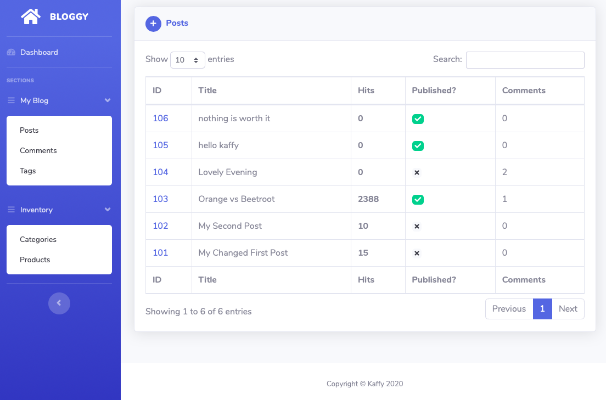
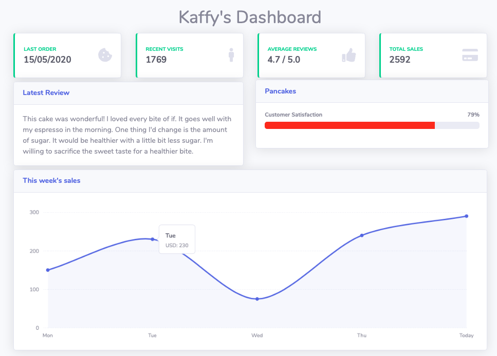
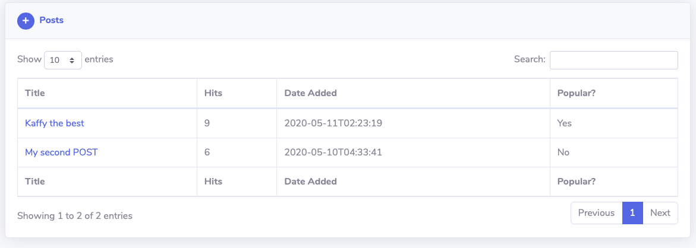
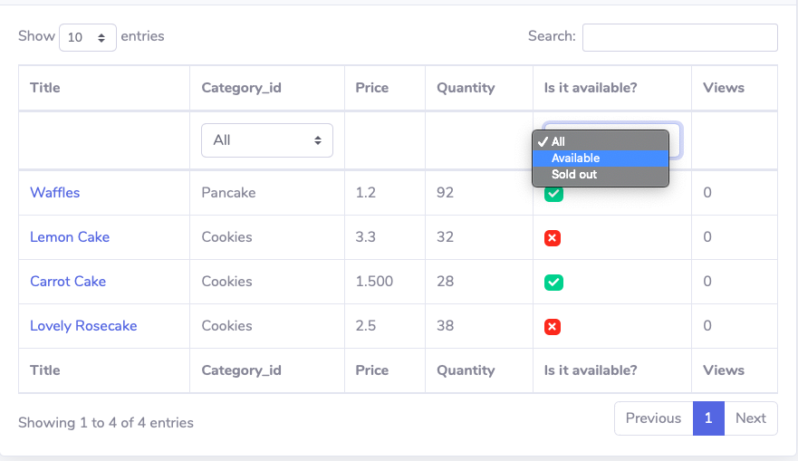
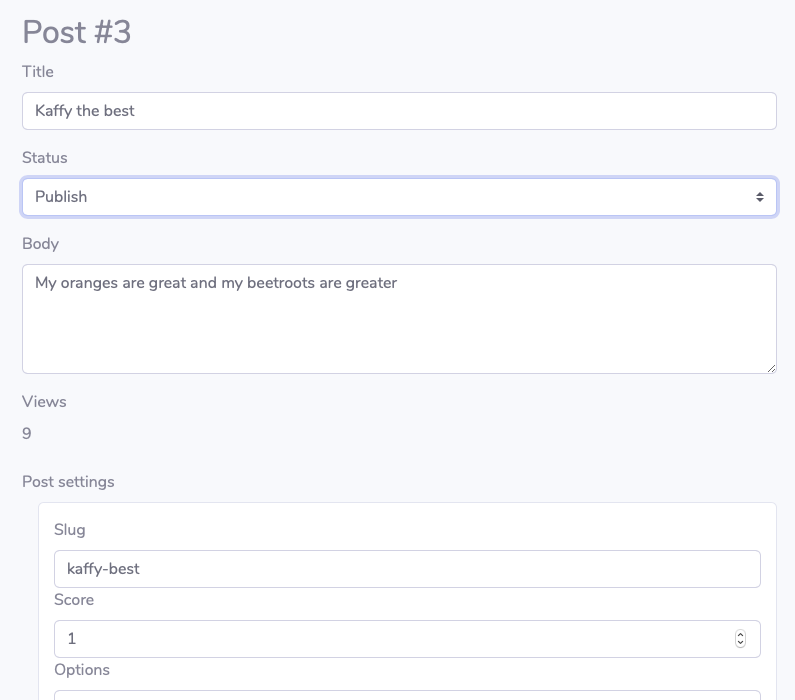
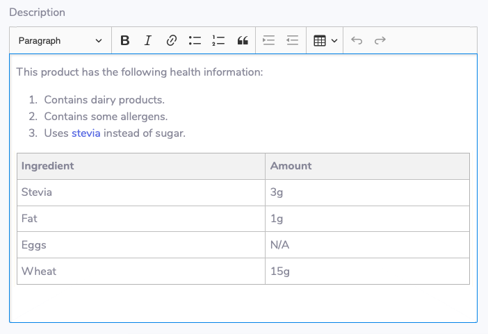
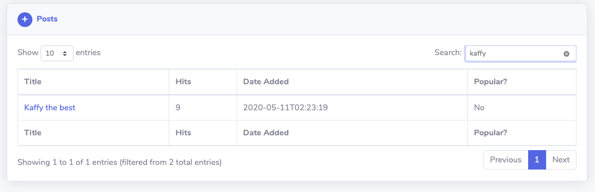
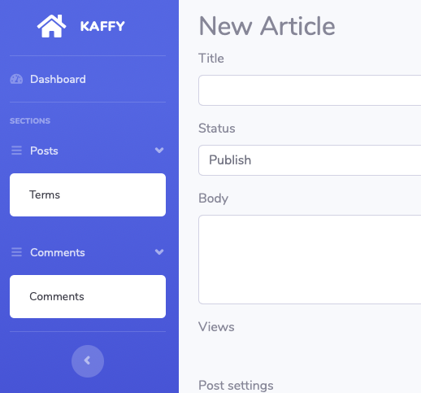
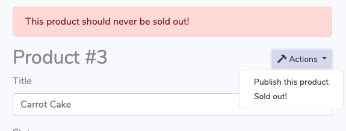
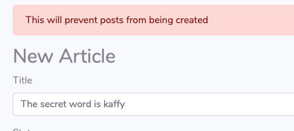

# Kaffy

Extremely simple yet powerful admin interface for phoenix applications

## Demo

[Check out the simple demo here for v0.5.0](https://kaffy.gigalixirapp.com/admin/)

## Minimum Requirements

- elixir 1.7.0
- phoenix 1.4.0

## Installation

#### Add `kaffy` as a dependency
```elixir
def deps do
  [
    {:kaffy, "~> 0.5.0"}
  ]
end
```

#### These are the minimum configurations required

```elixir
# in your router.ex
use Kaffy.Routes, scope: "/admin", pipe_through: [:some_plug, :authenticate]
# :scope defaults to "/admin"
# :pipe_through defaults to kaffy's [:kaffy_browser]

# in your endpoint.ex
plug Plug.Static,
  at: "/kaffy",
  from: :kaffy,
  gzip: false,
  only: ~w(css img js scss vendor)

# in your config/config.exs
config :kaffy,
  otp_app: :my_app,
  ecto_repo: Bloggy.Repo,
  router: BloggyWeb.Router
```


## What You Get



## Customizations

### Configurations

If you don't specify a `resources` option in your configs, Kaffy will try to auto-detect your schemas and your admin modules. Admin modules should be in the same namespace as their respective schemas in order for kaffy to detect them. For exmaple, if you have a schema `MyApp.Products.Product`, its admin module should be `MyApp.Products.ProductAdmin`.

Otherwise, if you'd like to explicitly specify your schemas and their admin modules, you can do like the following:

```elixir
# config.exs
config :kaffy,
  admin_title: "My Awesome App",
  ecto_repo: MyApp.Repo,
  router: MyAppWeb.Router,
  resources: [
    blog: [
      name: "My Blog", # a custom name for this context/section.
      schemas: [
        post: [schema: MyApp.Blog.Post, admin: MyApp.SomeModule.Anywhere.PostAdmin],
        comment: [schema: MyApp.Blog.Comment],
        tag: [schema: MyApp.Blog.Tag]
      ]
    ],
    inventory: [
      name: "Inventory",
      schemas: [
        category: [schema: MyApp.Products.Category, admin: MyApp.Products.CategoryAdmin],
        product: [schema: MyApp.Products.Product, admin: MyApp.Products.ProductAdmin]
      ]
    ]
  ]
```

Note that, for auto-detection to work properly, schemas in different contexts should have different direct "prefix" namespaces. That is:

```elixir
# auto-detection works properly with this:
MyApp.Posts.Post
MyApp.Posts.Category
MyApp.Products.Product
MyApp.Products.Category # this Category will not be confused with Posts.Category

# auto-detection will be confused with this:
# both Category schemas have the same "Schemas" prefix.
MyApp.Posts.Schemas.Post
MyApp.Posts.Schemas.Category
MyApp.Products.Schemas.Product
MyApp.Products.Schemas.Category

# To fix this, define resources manually:
resources: [
  posts: [
    schemas: [
      post: [schema: MyApp.Posts.Schemas.Post],
      category: [schema: MyApp.Posts.Schemas.Category]
    ]
  ],
  products: [
    schemas: [
      product: [schema: MyApp.Products.Schemas.Product],
      category: [schema: MyApp.Products.Schemas.Category]
    ]
  ]
]
```

### Dashboard page

Kaffy supports dashboard customizations through `widgets`.



Currently, kaffy provides support for 4 types of widgets:

- `text` widgets. Suitable for display relatively long textual information. Candidates: a short review, a specific message for the admin, etc.
- `tidbit` widgets. Suitable for tiny bits of information (one word, or one number). Cadidates: total sales, a specific date, system status ("Healthy", "Down"), etc.
- `progress` widgets. Suitable for measuring progres in terms of percentages. Candidates: task progress, survey results, memory usage, etc.
- `chart` widgets. Suitable for displaying chart data with X and Y values. Candidates: any measurable number over a period of time (e.g. sales, visits, etc).

Widgets have shared options:

- `:type` (required) is the type of the widget. Valid options are `text`, `tidbit`, `progress`, and `chart`.
- `:title` (required) is the title for the widget. What this widget is about.
- `:content` (required) is the main content of the widget. This can be a string or a map depending on the type of widget.
- `:order` (optional) is the displaying order of the wigdet. Widgets are display in order based on this value. The default value is 999.
- `:width` (optional) is the width the widget should occupy on the page. Valid values are 1 to 12. The default for tidbits is 3 and the others 6.
- `:percentage` (required for progress widgets) is the percentage value for the progress. This must be an integer.
- `:icon` (optional for tidbit widgets) is the icon displayed next to the tidbit's `content`. Any FontAwesome-valid icon is valid here. For example: `thumbs-up`.

When defining a chart widget, the content must be a map with the following required keys:

- `:x` must be a list of values for the x-axis.
- `:y` must be a list of numbers (integers/floats) for the y-axis.
- `:y_title` must be a string describing `:y` (e.g. USD, Transactions, Visits, etc)


To create widgets, define `widgets/2` in your admin modules.

`widgets/2` takes a schema and a `conn` and must return a list of widget maps:

```elixir
defmodule MyApp.Products.ProductAdmin do
  def widgets(_schema, _conn) do
    [
      %{
        type: "tidbit",
        title: "Average Reviews",
        content: "4.7 / 5.0",
        icon: "thumbs-up",
        order: 1,
        width: 6,
      },
      %{
        type: "progress",
        title: "Pancakes",
        content: "Customer Satisfaction",
        percentage: 79,
        order: 3,
        width: 6,
      },
      %{
        type: "chart",
        title: "This week's sales",
        order: 8,
        width: 12,
        content: %{
          x: ["Mon", "Tue", "Wed", "Thu", "Today"],
          y: [150, 230, 75, 240, 290],
          y_title: "USD"
        }
      }
    ]
  end
end
```

Kaffy will collect all widgets from all admin modules and orders them based on the `:order` option if present and displays them on the dashboard page.

### Index page

The `index/1` function takes a schema and must return a keyword list of fields and their options.

If the options are `nil`, Kaffy will use default values for that field.

If this function is not defined, Kaffy will return all fields with their respective values.

```elixir
defmodule MyApp.Blog.PostAdmin do
  def index(_) do
    [
      title: nil,
      views: %{name: "Hits"},
      date: %{name: "Date Added", value: fn p -> p.inserted_at end},
      good: %{name: "Popular?", value: fn _ -> Enum.random(["Yes", "No"]) end}
    ]
  end
end
```

Result



Notice that the keyword list keys don't necessarily have to be schema fields as long as you provide a `:value` option.

You can also provide some basic column-based filtration by providing the `:filters` option:

```elixir
defmodule MyApp.Products.ProductAdmin do
  def index(_) do
    [
      title: nil,
      category_id: %{
        value: fn p -> get_category!(p.category_id).name end,
        filters: Enum.map(list_categories(), fn c -> {c.name, c.id} end)
      },
      price: %{value: fn p -> Decimal.to_string(p.price) end},
      quantity: nil,
      status: %{
        name: "Is it available?",
        value: fn p -> available?(p) end,
        filters: [{"Available", "available"}, {"Sold out", "soldout"}]
      },
      views: nil
    ]
  end
end
```

`:filters` must be a list of tuples where the first element is a human-frieldy string and the second element is the actual field value used to filter the records.

Result



If you need to change the order of the records, define `ordering/1`:

```elixir
defmodule MyApp.Blog.PostAdmin do
  def ordering(_schema) do
    # order posts based on views
    [desc: :views]
  end
end
```


### Show/edit page

Kaffy treats the show and edit pages as one.

To customize the fields shown in this page, define a `form_fields/1` function in your admin module.

```elixir
defmodule MyApp.Blog.PostAdmin do
  def form_fields(_) do
    [
      title: nil,
      status: %{choices: [{"Publish", "publish"}, {"Pending", "pending"}]},
      body: %{type: :textarea, rows: 4},
      views: %{permission: :read},
      settings: %{label: "Post Settings"}
    ]
  end
end
```

The `form_fields/1` function takes a schema and should return a keyword list of fields and their options.

The keys of the list must correspond to the schema fields.

Options can be:

- `:label` - must be a string.
- `:type` - can be any ecto type in addition to `:file`, `:textarea`, and `:richtext`.
- `:rows` - an integer to indicate the number of rows for textarea fields.
- `:choices` - a keyword list of option and values to restrict the input values that this field can accept.
- `:permission` - can be either `:write` (field is editable) or `:read` (field is non-editable). It is `:write` by default.


Result



Setting a field's type to `:richtext` will render a rich text editor like the following:



Notice that:

- Even though the `status` field is of type `:string`, it is rendered as a `<select>` element with choices.
- The `views` field is rendered as "readonly" because it has the `:read` permission.
- `settigns` is an embedded schema. That's why it is rendered as such.

### Search

Kaffy provides very basic search capabilities.

Currently, only `:string` and `:text` fields are supported for search.

If you need to customize the list of fields to search against, define the `search_fields/1` function.

```elixir
defmodule MyApp.Blog.PostAdmin do
  def search_fields(_schema) do
    [:title, :slug, :body]
  end
end
```

This function takes a schema and returns a list of schema fields that you want to search. 
All the fields must be of type `:string` or `:text`.

If this function is not defined, Kaffy will return all `:string` and `:text` fields by default.

Result



### Authorization

Kaffy supports basic authorization for individual schemas by defining `authorized?/2`.

```elixir
defmodule MyApp.Blog.PostAdmin do
  def authorized?(_schema, conn) do
    MyApp.Blog.can_see_posts?(conn.assigns.user)
  end
end
```

`authorized?/2` takes a schema and a `Plug.Conn` struct and should return a boolean value.

If it returns `false`, the request is redirected to the dashboard with an unauthorized message.

Note that the resource is also removed from the resources list if `authorized?/2` returns false.

Result


### Changesets

Kaffy supports separate changesets for creating and updating schemas.

Just define `create_changeset/2` and `update_changeset/2`.

Both of them are passed the schema and the attributes.

```elixir
defmodule MyApp.Blog.PostAdmin do
  def create_changeset(schema, attrs) do
    # do whatever you want, must return a changeset
    MyApp.Blog.Post.my_customized_changeset(schema, attrs)
  end

  def update_changeset(entry, attrs) do
    # do whatever you want, must return a changeset
    MyApp.Blog.Post.update_changeset(entry, attrs)
  end
end
```

If either function is not defined, Kaffy will try calling `Post.changeset/2`.

And if that is not defined, `Ecto.Changeset.change/2` will be called.

### Singular vs Plural

Some names do not follow the "add an s" rule. Sometimes you just need to change some terms to your liking.

This is why `singular_name/1` and `plural_name/1` are there.

```elixir
defmodule MyApp.Blog.PostAdmin do
  def singular_name(_) do
    "Article"
  end

  def plural_name(_) do
    "Terms"
  end
end
```

Result



Notice the "Posts" above the "Terms". This is the context name and it can be changed in the `configs.exs` file. 
See the "Configurations" section above.

### Custom Actions

Kaffy supports performing custom actions on single resources by defining the `resource_actions/1` function.

```elixir
defmodule MyApp.Blog.ProductAdmin
  def resource_actions(_conn) do
    [
      publish: %{name: "Publish this product", action: fn _c, p -> restock(p) end},
      soldout: %{name: "Sold out!", action: fn _c, p -> soldout(p) end}
    ]
  end

  defp restock(product) do
    update_product(product, %{"status" => "available"})
  end

  defp soldout(product) do
    case product.id == 3 do
      true ->
        {:error, product, "This product should never be sold out!"}

      false ->
        update_product(product, %{"status" => "soldout"})
    end
  end
```

Result



`resource_actions/1` takes a `conn` and must return a keyword list. 
The keys must be atoms defining the unqiue action "keys".
The values are maps providing a human-friendly `:name` and an `:action` that is an anonymous function with arity 2 that takes a `conn` and the record.

Actions must return one of the following:

- `{:ok, record}` indicating the action was performed successfully.
- `{:error, changeset}` indicating there was a validation error.
- `{:error, record, custom_error}` to communicate a custom error message to the user where custom_error is a string.

### Callbacks

Sometimes you need to execute certain actions when creating, updating, or deleting records.

Kaffy has your back.

There are a few callbacks that are called every time you create, update, or delete a record.

These callbacks are:

- `before_create/2`
- `before_update/2`
- `before_delete/2`
- `before_save/2`
- `after_save/2`
- `after_delete/2`
- `after_update/2`
- `after_create/2`

`before_*` functions are passed the current `conn` and a changeset. `after_*` functions are passed the current `conn` and the record itself. With the exception of `before_delete/2` and `after_delete/2` which are both passed the current `conn` and the record itself.

- `before_(create|save|update)/2` must return `{:ok, changeset}` to continue.
- `before_delete/2` must return `{:ok, record}` to continue.
- All `after_*` functions must return `{:ok, record}` to continue.

To prevent the chain from continuing and roll back any changes:

- `before_(create|save|update)/2` must return `{:error, changeset}`.
- `before_delete/2` must return `{:error, record, "Customized error message}`.
- All `after_*` functions must return `{:error, record, "Customized error message"}`.

When creating a new record, the following functions are called in this order:

- `before_create/2`
- `before_save/2`
- inserting the record happens here: `Repo.insert/1`
- `after_save/2`
- `after_create/2`

When updating an existing record, the following functions are called in this order:

- `before_update/2`
- `before_save/2`
- updating the record happens here: `Repo.update/1`
- `after_save/2`
- `after_update/2`

When deleting a record, the following functions are called in this order:

- `before_delete/2`
- deleting the record happens here: `Repo.delete/1`
- `after_delete/2`

It's important to know that all callbacks are run inside a transaction. So in case of failure, everything is rolled back even if the operation actually happened.

```elixir
defmodule MyApp.Blog.PostAdmin do
  def before_create(conn, changeset) do
    case conn.assigns.user.username == "aesmail" do
      true -> {:error, changeset} # aesmail should never create a post
      false -> {:ok, changeset}
    end
  end

  def after_create(_conn, post) do
    {:error, post, "This will prevent posts from being created"}
  end

  def before_delete(conn, post) do
    case conn.assigns.user.role do
      "admin" -> {:ok, post}
      _ -> {:error, post, "Only admins can delete posts"}
    end
  end
end
```

Result





### Random features

- If you have a schema with a `belongs_to` association and this association has too many records to be included in a `<select>` box, Kaffy will automatically change the field from a `<select>` box to a text box and opens a new where the association records are paginated and filterable so you can select the necessary record with ease.

## Why another admin interface

Kaffy was created out of a need to have a minimum, flexible, and customizable admin interface 
without the need to touch the current codebase. It should work out of the box just by adding some
configs in your `config.exs` file (with the exception of adding a one liner to your `router.ex` file).

A few points that encouraged the creation of Kaffy:

- Taking contexts into account.
  - Supporting contexts makes the admin interface better organized.
- Can handle as many schemas as necessary.
  - Whether we have 1 schema or 1000 schemas, the admin interface should adapt well.
- Have a visually pleasant user interface.
  - This might be subjective.
- No generators or generated templates.
  - I believe the less files there are the better. This also means it's easier to upgrade for users when releasing new versions. This might mean some flexibility and customizations will be lost, but it's a trade-off.
- Existing schemas/contexts shouldn't have to be modified.
  - I shouldn't have to change my code in order to adapt to the package, the package should adapt to my code.
- Should be easy to use whether with a new project or with existing projects with a lot of schemas.
  - Adding kaffy should be as easy for existing projects as it is for new ones.
- Highly flexible and customizable.
  - Provide as many configurable options as possible.
- As few dependencies as possible.
  - Currently kaffy only depends on phoenix and ecto.
- Simple authorization.
  - I need to limit access for some admins to some schemas.
- Minimum assumptions.
  - Need to modify a schema's primary key? Need to hide a certain field? No problem.


The design and philosophy of Kaffy was inspired mainly by the following:

- The built-in admin app for django.
- The ActiveAdmin gem for rails.
