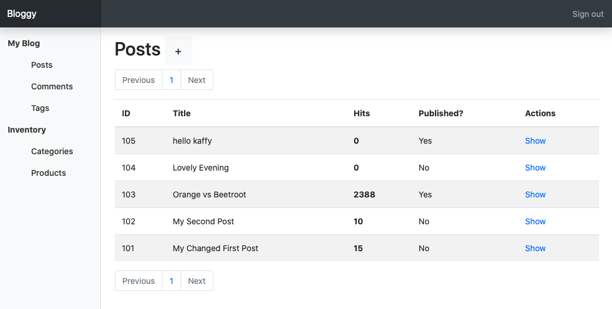
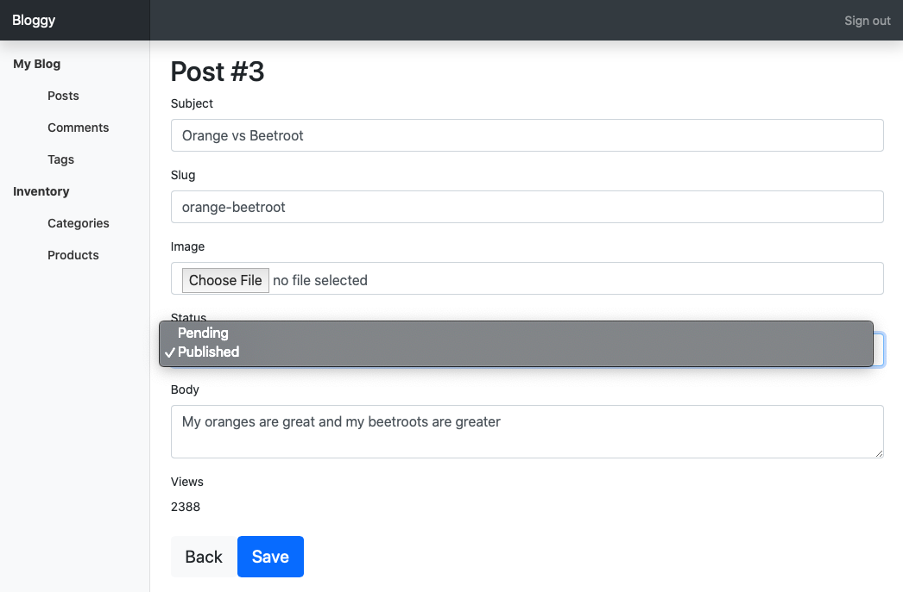

# Kaffy

Extremely simple yet powerful admin interface for phoenix applications

## Why another admin interface

Kaffy was created out of a need to have a minimum, flexible, and customizable admin interface 
without the need to touch the current codebase. It should work out of the box just by adding some
configs in your `config.exs` file (with the exception of adding a one liner to your `router.ex` file).

A few points that encouraged the creation of Kaffy:

- Taking contexts into account
- No templates. All customizations are code-based.
- No generators. Shouldn't need them.
- Highly flexible and customizable.
- As few dependencies as possible. Currently it only depends on what phoenix depends on.

## Installation

```elixir
def deps do
  [
    {:kaffy, "~> 0.1.0"}
  ]
end
```

## What You Get



## Minimum configs

```elixir
# in your config/config.exs
config :kaffy,
  ecto_repo: Bloggy.Repo,
  router: BloggyWeb.Router,
  resources: [
    blog: [
      schemas: [
        post: [schema: Bloggy.Blog.Post],
        comment: [schema: Bloggy.Blog.Comment],
        tag: [schema: Bloggy.Blog.Tag]
      ]
    ]
  ]

# in your router.ex
use Kaffy.Routes, scope: "/admin"
```

## Customizations

```elixir
# config.exs
config :kaffy,
  admin_title: "Bloggy",
  ecto_repo: Bloggy.Repo,
  router: BloggyWeb.Router,
  resources: [
    blog: [
      name: "My Blog", # the name of this "context"
      schemas: [
        post: [schema: Bloggy.Blog.Post, admin: Bloggy.Admin.PostAdmin],
        comment: [schema: Bloggy.Blog.Comment],
        tag: [schema: Bloggy.Blog.Tag]
      ]
    ],
    inventory: [
      name: "Inventory",
      schemas: [
        category: [schema: Bloggy.Products.Category, admin: Bloggy.Admin.CategoryAdmin],
        product: [schema: Bloggy.Products.Product, admin: Bloggy.Admin.ProductAdmin]
      ]
    ]
  ]
```

The following admin module is what the screenshot above is showing:

```elixir
# all the functions are optional

defmodule Bloggy.Admin.PostAdmin do
  def index(_schema) do
    # index should return a keyword list of fields and
    # their options.
    # Supported options are :name and :value.
    # both options can be a string or an anonymous function.
    # if a fuction is provided, the current entry is passed to it.
    # if this function is not defined, Kaffy will return all the fields of the schema and their default values
    [
      id: %{name: "ID", value: fn post -> post.id + 100 end},
      title: nil,
      views: %{name: "Hits", value: fn post -> {:safe, "<strong>#{post.views}</strong>"} end},
      published: %{name: "Published?", value: fn post -> published?(post) end}
    ]
  end

  def form_fields(_schema) do
    # supported options are:
    # :label, :type, :choices, :permissions
    # :type can be any ecto type in addition to :file and :textarea
    # if :choices is provided, it must be a keyword list and
    # the field will be a <select> element regardless of the actual field type.
    # Settings :permission to :read will make the field non-editable.
    # if this function is not defined, Kaffy will return all the fields with
    # their default types based on the schema.
    [
      title: %{label: "Subject"},
      slug: nil,
      image: %{type: :file},
      status: %{choices: [{"Pending", "pending"}, {"Published", "published"}]},
      body: %{type: :textarea},
      views: %{permission: :read}
    ]
  end

  def ordering(_) do
    # this returns how the entries should be ordered
    # if this function is not defined, Kaffy will return [desc: :id]
    [desc: :id]
  end

  def authorized?(_schema, _conn) do
    # authorized? is passed the schema and the Plug.Conn struct and
    # should return a boolean value.
    # returning false will prevent the access of this resource for the current user/request
    # if this function is not defined, Kaffy will return true.
    true
  end

  def create_changeset(schema, attrs) do
    # this function should return a changeset for creating a new record
    # if this function is not defined, Kaffy will try to call:
    # schema.changeset/2
    # and if that's not defined, Ecto.Changeset.change/2 will be called.
    Bloggy.Blog.Post.create_changeset(schema, attrs)
  end

  def update_changeset(entry, attrs) do
    # this function should return a changeset for updating an existing record.
    # if this function is not defined, Kaffy will try to call:
    # schema.changeset/2
    # and if that's not defined, Ecto.Changeset.change/2 will be called.
    Bloggy.Blog.Post.update_changeset(entry, attrs)
  end

  def singular_name(_schema) do
    # if this function is not defined, Kaffy will use the name of
    # the last part of the schema module (e.g. Post)
    "Article"
  end

  def plural_name(_schema) do
    # if this function is not defined, Kaffy will use the singular
    # name and add a "s" to it (e.g. Posts)
    "Articles"
  end

  def published?(post) do
    if post.status == "published", do: "Yes", else: "No"
  end
end
```



## Future plans

- [ ] Better support for associations.
- [ ] Add a way to sign out of the current session.
- [ ] Add filtration.
- [ ] Export data as csv.
- [ ] Add documentation.
